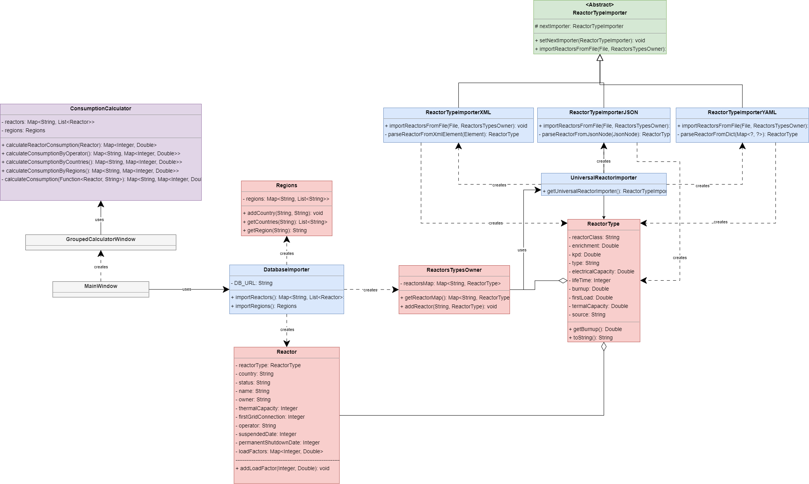

# README

## Описание проекта

Этот проект представляет собой приложение на Java с графическим интерфейсом, которое позволяет импортировать данные из базы данных SQLite (*.db) и производить различные расчеты на основе данных о реакторах, странах и регионах. Приложение визуализирует данные в виде дерева и предоставляет функции для расчета потребления реакторов по стране, региону и оператору.

## Функциональность

1. **Импорт данных**: Пользователь может импортировать файл базы данных SQLite (.db) с данными о реакторах, странах и регионах.
2. **Визуализация данных**: Импортированные данные отображаются в виде дерева, где корнем является узел "Реакторы", а дочерние узлы представляют собой страны и их реакторы.
3. **Просмотр информации о реакторе**: Двойной щелчок по узлу реактора в дереве открывает окно с подробной информацией о выбранном реакторе.
4. **Расчеты потребления**: Пользователь может выполнить расчеты потребления реакторов:
    - По странам
    - По регионам
    - По операторам
5. **Отображение результатов расчетов**: Результаты расчетов отображаются в таблице.

## Структура проекта

### Основные компоненты

- **MainWindow**: Главный класс приложения, отвечает за отображение основного окна, импорт данных и их визуализацию.
- **GroupedCalculatorWindow**: Класс, отвечающий за отображение окна расчетов и выполнение расчетов потребления.
- **DatabaseImporter**: Класс, предоставляющий методы для импорта данных из базы данных SQLite.
- **Reactor**: Класс, представляющий реактор и содержащий его данные.
- **Regions**: Класс, представляющий регионы и их данные.
- **ConsumptionCalculator**: Класс, выполняющий расчеты потребления реакторов.

### Схема проекта (UML)

## Установка и запуск

1. **Требования**:
    - Java 21 или выше

2. **Сборка и запуск**:
    - Склонируйте репозиторий проекта на ваш локальный компьютер.
    - Убедитесь, что у вас установлена Java и настроена среда разработки.
    - Откройте проект в вашей IDE (например, IntelliJ IDEA).
    - Скомпилируйте и запустите проект, запустив главный класс `MainWindow`.

## Использование

1. Запустите приложение.
2. Нажмите кнопку "Импортировать" и выберите файл базы данных SQLite (.db).
3. Данные из выбранного файла будут загружены и отображены в виде дерева.
4. Дважды щелкните по узлу реактора, чтобы увидеть его полное описание.
5. Нажмите кнопку "Рассчитать", чтобы открыть окно расчетов.
6. Выберите тип расчета (по стране, региону или оператору) и посмотрите результаты в таблице.

## Релиз

В релизе находится скомпилированная версия приложения со всеми зависимостями. Для запуска требуется только установленная версия JDK 21 или выше. 

## Ошибки и отладка

- Если при импорте файла возникает ошибка, убедитесь, что файл имеет правильный формат (.db) и содержит необходимые данные.
- Если данные не отображаются, проверьте структуру файла базы данных.
